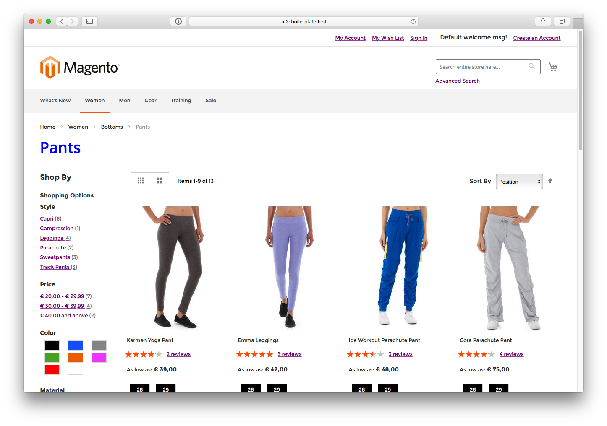
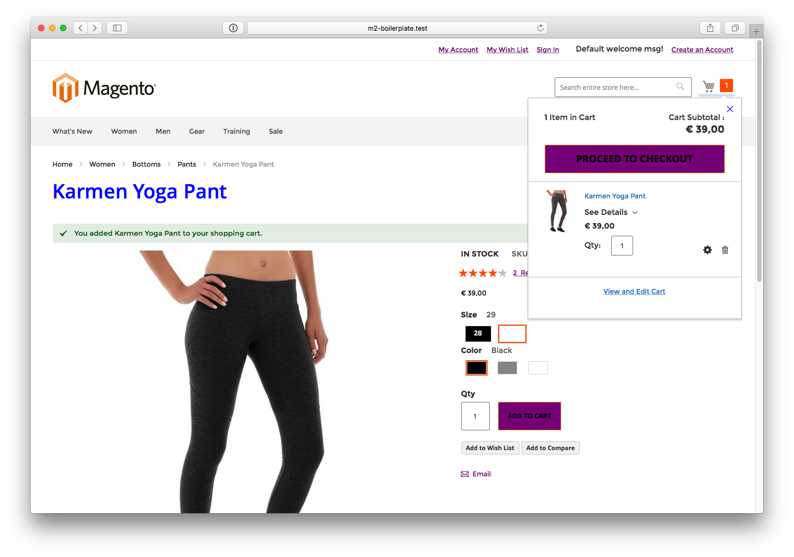
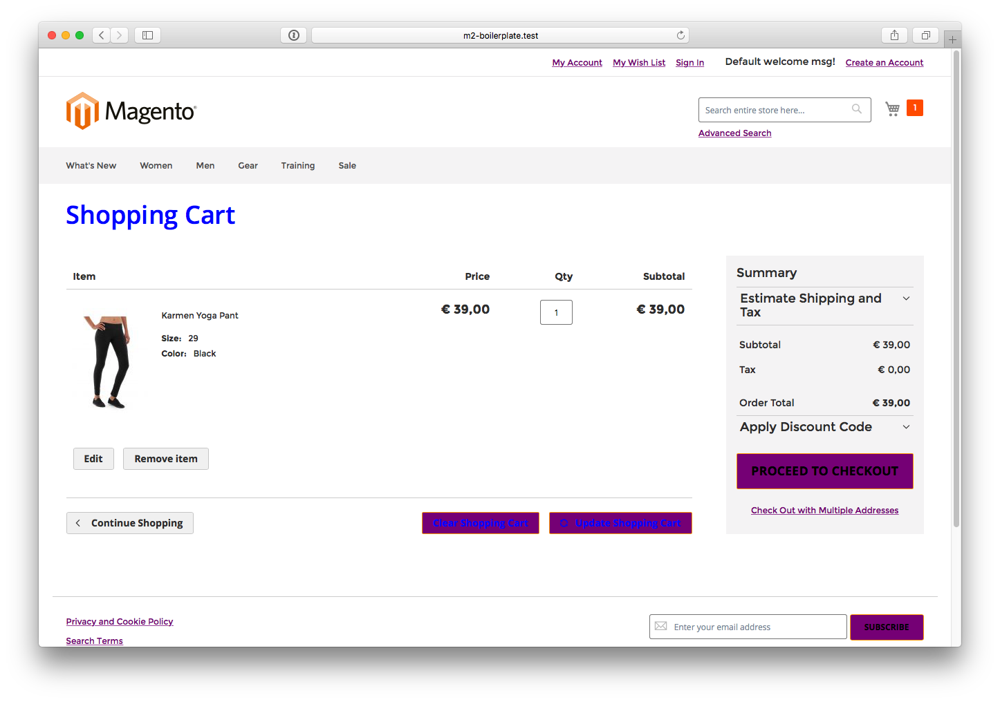
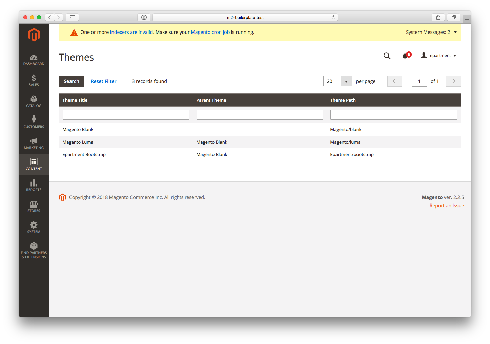

# Magento 2 SASS boilerplate theme
A Magento 2, **SASS** based boilerplate theme with focus on ease-of-use and quick results. The boilerplate variables cover a great range of elements, so that any design is quickly implemented with the propper classes inherits and re-use of the standard Magento Blank theme objects.

A Demo will be available soon! This Magento 2 SASS theme is developed by [Epartment E-commerce](https://www.epartment.nl/).

[More images](https://github.com/epartment/magento2-theme-epartment-boilerplate#user-content-demo-images).

---

### Compatibility
* Magento 2.2
* Magento 2.1
* Magento 2.0

### Bug reports and contribution rules
- Before reporting an issue, check if you can reproduce it on the clean Magento instance without our boilerplate. If that's true, submit issue to the Magento 2 repository, not here
- Al other issues can be reported here

### Questions
If you want to know more about this project, join our slack channel and ask questions.

### Requirements
- Node.js (https://nodejs.org/)
- npm (https://npmjs.org) 
- yarn (https://yarnpkg.com/)

> <strong>Note</strong>: You only need one package manager, so either yarn or npm.

### Installation
> **Disclaimer**:
> This installation guide expects you to have a Magento 2 instance running. If you need help to get Magento 2 up and running, we'd like to refer you to the install guide: https://devdocs.magento.com/guides/v2.2/install-gde/prereq/zip_install.html

##### Creating the right folder structure
1. Open the Magento 2 project where you want to install the boilerplate in your IDE/Code editor of choice.
2. Navigate to the `app/design/frontend` folder.
3. Create a new directory named `Epartment`.
4. Open your terminal/commandline.
5. `cd` into `app/design/frontend/Epartment`.
6. Clone the git repository in a new directory called `bootstrap` note the lowercase.  
`git clone https://github.com/epartment/magento2-theme-epartment-boilerplate.git bootstrap`.

##### Installing the required dependencies using npm or yarn
1. In your terminal/commandline: `cd` into the newly created `app/design/frontend/Epartment/bootstrap` folder.
2. Run the following command: `yarn install`. Alternatively it's also possible to do `npm install`. 

##### Setting the boilerplate as the active theme in the Magento 2 backend
1. Login to your Magento 2 backend.
2. Go to `Content > Design > Configuration`.
3. Select the `Website`, `Store` or `Storeview` where you want to have the boilerplate theme activated and click `edit`.
4. Now in the `Applied Theme` dropdown, please select `Epartment Bootstrap` option and click `Save Configuration`.
5. Go back to the Frontend en reload the page.
6. You have succesfully installed the Epartment Magento 2 Boilerplate.

### Extending and editing the boilerplate styling
> **Note**: The Epartment Magento 2 Boilerplate uses SASS for styling.

##### Editing existing variables
1. In your project navigate to the `app/design/frontend/Epartment/bootstrap/src/scss/boilerplate` folder.
2. You can take a look into the variables chapter of this README to get a full list of variables you can target.
3. Overwriting the default variables is done by creating a new `.scss` file e.g. `_websitename.scss` in the `scss/boilerplate` folder, adding the `.scss` as an `@import` in `style.scss`. Make sure the `@import` is above the boilerplate import or the value's will not be redeclared. And finally in the newly created file, redeclare the variables you want to overwrite.
4. Run a `gulp` command to compile the styling changes. More info about the `gulp` commands can be found in the next chapter. 

##### Extending with custom styling
> **Note**: The boilerplate variables cover a great range of elements. Try to modify the variables first before adding any custom `.scss` files!

1. In your project navigate to the `app/design/frontend/Epartment/bootstrap/src/scss` folder.
2. Create a new `.scss` file e.g. `_custom_hero_homepage.scss`.
3. Write some awesome `SASS`.
4. Note: Don't forget to include the new `.scss` created before as a `@import` in the `style.scss`.
5. Run a `gulp` command to compile the styling changes. More info about the `gulp` commands can be found in the next chapter. 

##### Variables
These are the default variables that can be overwritten by creating a custom `SASS` file. You can simply target the variable again and overrule the default value.
For example: `$font-default-font-size: 18px;`

###### Colors
| Variable                                     | Description 
|----------------------------------------------|------------------------
| `$color-boilerplate-primary`                 | Primary theme color, accepted formats: HEX, RGB, RGBA, variable. 
| `$color-boilerplate-secondary`               | Secondary theme color, accepted formats: HEX, RGB, RGBA, variable.
| `$color-primary-gradient-color`              | Primary gradient
| `$color-secondary-gradient-color`            | Secondary gradient

###### Fonts
| Variable                                     | Description
|----------------------------------------------|-------------------------
| `$font-default-font-family-primary`          | Default primary font.
| `$font-default-font-family-secondary`        | Default secondary font.
| `$font-default-font-size`                    | Default font-size, accepted formats: px, rem or a variable which contains one of these.
| `$font-default-font-weight`                  | Default font-weight, accepted formats: 100-800 or a variable containing one of these.
| `$font-default-font-line-height`             | Default font line-height, accepted formats: px, rem or a variable containing one of those.
| `$font-default-color`                        | Default font color, accepted formats: HEX, RGB, RGBA or a variable containing one of these.
| `$font-default-heading-color`                | Default font-heading color, accepted formats: HEX, RGB, RGBA or a variable containing one of those.
| `$font-family`                               | Default font family.

###### Headings
| Variable                                     | Description
|----------------------------------------------|-------------------------
| `$font-family-heading`                       | Default heading font-family, eg. 'Open Sans'.                                    
| `$font-family-heading-color`                 | Default heading color, accepted formats: Variable, HEX, RGB en RGBA.
| `$font-family-heading-font-weight`           | Default heading font-weight, accepted value's: 100-800 or a variable containing it.
| `$font-family-heading-line-height`           | Default heading line-height, accepted formats: px, rem or a variable containing it.
| `$font-family-heading-h1-font-size`          | H1 font-size, accepted formats: px, rem or a variable containing it.
| `$font-family-heading-h1-font-weight`        | H1 font-weight, accepted value's: 100-800 or a variable containing it.
| `$font-family-heading-h1-line-height`        | H1 line-height, accepted formats: px, rem or a variable containing it.
| `$font-family-heading-h1-margin`             | H1 margin, accepted formats: px, rem or a variable containing it.
| `$font-family-heading-h1-color`              | H1 color, accepted formats: HEX, RGB, RGBA or a variable containing one of these.
| `$font-family-heading-h2-font-size`          | H2 font-size, accepted formats: px, rem or a variable containing it.
| `$font-family-heading-h2-font-weight`        | H2 font-weight, accepted value's: 100-800 or a variable containing it.
| `$font-family-heading-h2-line-height`        | H2 line-height, accepted formats: px, rem or a variable containing it.
| `$font-family-heading-h2-margin`             | H2 margin, accepted formats: px, rem or a variable containing it.
| `$font-family-heading-h2-color`              | H2 color, accepted formats: HEX, RGB, RGBA or a variable containing one of these.
| `$font-family-heading-h3-font-size`          | H3 font-size, accepted formats: px, rem or a variable containing it.
| `$font-family-heading-h3-font-weight`        | H3 font-weight, accepted value's: 100-800 or a variable containing it.
| `$font-family-heading-h3-margin`             | H3 margin, accepted formats: px, rem or a variable containing it.
| `$font-family-heading-h3-color`              | H3 color, accepted formats: HEX, RGB, RGBA or a variable containing one of these.
| `$font-family-heading-h4-font-size`          | H4 font-size, accepted formats: px, rem or a variable containing it.
| `$font-family-heading-h4-font-weight`        | H4 font-weight, accepted value's: 100-800 or a variable containing it.
| `$font-family-heading-h4-margin`             | H4 margin, accepted formats: px, rem or a variable containing it.
| `$font-family-heading-h4-color`              | H4 color, accepted formats: HEX, RGB, RGBA or a variable containing one of these.
| `$font-family-heading-h5-font-size`          | H5 font-size, accepted formats: px, rem or a variable containing it.
| `$font-family-heading-h5-font-weight`        | H5 font-weight, accepted value's: 100-800 or a variable containing it.
| `$font-family-heading-h5-margin`             | H5 margin, accepted formats: px, rem or a variable containing it.
| `$font-family-heading-h5-color`              | H5 color, accepted formats: HEX, RGB, RGBA or a variable containing one of these.
| `$font-family-heading-h6-font-size`          | H6 font-size, accepted formats: px, rem or a variable containing it.
| `$font-family-heading-h6-font-weight`        | H6 font-weight, accepted formats: 100-800 or a variable containing it.
| `$font-family-heading-h6-margin`             | H6 margin, accepted formats: px,rem or a variable containing one of these.
| `$font-family-heading-h6-color`              | H6 color, accepted formats: HEX, RGB, RGBA or a variable containing one of these.

###### Links
| Variable                                     | Description
|----------------------------------------------|-------------------------
| `$font-default-link-color`                   | Default link color, accepted formats: HEX, RGB, RGBA or a variable containing one of these.
| `$font-default-link-text-decoration`         | Default link text-decoration.
| `$font-default-link-font-weight`             | Default link font-weight, accepted value's: 100-800 or a variable containing it.
| `$font-default-link-hover-color`             | Default color in hover-state, accepted formats: HEX, RGB, RGBA or a variable containing one of these.
| `$font-default-link-hover-text-decoration`   | Default text-decoration in hover-state.
| `$font-default-link-hover-font-weight`       | Default font-weight in hover-state, accepted value's: 100-800 or a variable containing it.
| `$font-header-link-color`                    | Header link color, accepted formats: HEX, RGB, RGBA or a variable containing one of these.
| `$font-header-link-text-decoration`          | Header link text-decoration.
| `$font-header-link-font-weight`              | Header link font-weight, accepted value's: 100-800 or a variable containing it.
| `$font-header-link-hover-color`              | Header link color in hover-state, accepted formats: HEX, RGB, RGBA or a variable containing one of these.
| `$font-header-link-hover-text-decoration`    | Header link text-decoration in hover-state.
| `$font-header-link-hover-font-weight`        | Header link font-weight in hover-state, accepted value's: 100-800 or a variable containing it.
| `$font-footer-link-color`                    | Footer link color, accepted formats: HEX, RGB, RGBA or a variable containing one of these.
| `$font-footer-link-text-decoration`          | Footer link text-decoration.
| `$font-footer-link-font-weight`              | Footer link font-weight, accepted value's: 100-800 or a variable containing it.
| `$font-footer-link-hover-color`              | Footer link color in hover-state, accepted formats: HEX, RGB, RGBA or a variable containing one of these.
| `$font-footer-link-hover-text-decoration`    | Footer link text-decoration in hover-state.
| `$font-footer-link-hover-font-weight`        | Footer link font-weight in hover-state, accepted value's: 100-800 or a variable containing it.

###### Titles
| Variable                                     | Description
|----------------------------------------------|-------------------------
| `$font-filter-title-font-size`               | Filter title font-size, accepted formats: px, rem or a variable containing it.
| `$font-filter-title-font-weight`             | Filter title font-weight, accepted value's: 100-800 or a variable containing it.
| `$font-filter-title-line-height`             | Filter title line-height, accepted formats: px, rem or a variable containing it.
| `$font-filter-title-margin`                  | Filter title margin, accepted formats: px, rem or a variable containing it.
| `$font-filter-title-color`                   | Filter title color, accepted formats: HEX, RGB, RGBA or a variable containing one of these.
| `$font-filter-subtitle-font-size`            | Filter subtitle font-size, accepted formats: px, rem or a variable containing it.
| `$font-filter-subtitle-font-weight`          | Filter subtitle font-weight, accepted value's: 100-800 or a variable containing it.
| `$font-filter-subtitle-line-height`          | Filter subtitle line-height, accepted formats: px, rem or a variable containing it.
| `$font-filter-subtitle-margin`               | Filter subtitle margin, accepted formats: px, rem or a variable containing it.
| `$font-filter-subtitle-color`                | Filter subtitle color, accepted formats: HEX, RGB, RGBA or a variable containing one of these.
| `$font-filter-options-title-font-size`       | Filter options title font-size, accepted formats: px, rem or a variable containing it.
| `$font-filter-options-title-font-weight`     | Filter options title font-weight, accepted value's: 100-800 or a variable containing it.
| `$font-filter-options-title-line-height`     | Filter options title line-height, accepted formats: px, rem or a variable containing it.
| `$font-filter-options-title-margin`          | Filter options title margin, accepted formats: px, rem or a variable containing it.
| `$font-filter-options-title-color`           | Filter options title color, accepted formats: HEX, RGB, RGBA or a variable containing one of these.
| `$font-product-item-name-font-size`          | Product item title (lister) font-size, accepted formats: px, rem or a variable containing it.
| `$font-product-item-name-font-weight`        | Product item title (lister) font-weight, accepted value's: 100-800 or a variable containing it.
| `$font-product-item-name-line-height`        | Product item title (lister) line-height, accepted formats: px, rem or a variable containing it.
| `$font-product-item-name-margin`             | Product item title (lister) margin, accepted formats: px, rem or a variable containing it.
| `$font-product-item-name-color`              | Product item title (lister) color, accepted formats: HEX, RGB, RGBA or a variable containing one of these.

###### Buttons
| Variable                                     | Description
|----------------------------------------------|-------------------------
| `$button-default-background-color`           | Default button background color, accepted formats: HEX, RGB, RGBA or a variable containing one of these.
| `$button-default-border`                     | Default button border.
| `$button-default-border-radius`              | Default button border-radius.
| `$button-default-color`                      | Default button text-color, accepted formats: HEX, RGB, RGBA or a variable containing one of these.
| `$button-default-font-size`                  | Default button font-size, accepted formats: px, rem or a variable containing it.
| `$button-default-font-weight`                | Default button font-weight, accepted value's: 100-800 or a variable containing it.
| `$button-default-transition`                 | Default button transition effect (animation).
| `$button-default-padding`                    | Default button padding.
| `$button-default-text-transform`             | Default button text-transform.
| `$button-default-hover-background-color`     | Default button hover-state background color, accepted formats: HEX, RGB, RGBA or a variable containing one of these.
| `$button-default-hover-border`               | Default button hover-state border.
| `$button-default-hover-color`                | Default button hover-state text-color, accepted formats: HEX, RGB, RGBA or a variable containing one of these.
| `$button-primary-background-color`           | Primary button background color, accepted formats: HEX, RGB, RGBA or a variable containing one of these.
| `$button-primary-border`                     | Primary button border.
| `$button-primary-border-radius`              | Primary button border-radius.
| `$button-primary-color`                      | Primary button text-color, accepted formats: HEX, RGB, RGBA or a variable containing one of these.
| `$button-primary-font-size`                  | Primary button font-size, accepted formats: px, rem or a variable containing it.
| `$button-primary-font-weight`                | Primary button font-weight, accepted value's: 100-800 or a variable containing it.
| `$button-primary-transition`                 | Primary button transition effect (animation).
| `$button-primary-padding`                    | Primary button padding.
| `$button-primary-text-transform`             | Primary button text-transform.
| `$button-primary-hover-background-color`     | Primary button hover-state background color, accepted formats: HEX, RGB, RGBA or a variable containing one of these.
| `$button-primary-hover-border`               | Primary button hover-state border.
| `$button-primary-hover-color`                | Primary button hover-state text-color, accepted formats: HEX, RGB, RGBA or a variable containing one of these.
| `$button-secondary-background-color`         | Secondary button background color, accepted formats: HEX, RGB, RGBA or a variable containing one of these.
| `$button-secondary-border`                   | Secondary button border.
| `$button-secondary-border-radius`            | Secondary button border-radius.
| `$button-secondary-color`                    | Secondary button text-color, accepted formats: HEX, RGB, RGBA or a variable containing one of these.
| `$button-secondary-font-size`                | Secondary button font-size, accepted formats: px, rem or a variable containing it.
| `$button-secondary-font-weight`              | Secondary button font-weight, accepted value's: 100-800 or a variable containing it.
| `$button-secondary-transition`               | Secondary button transition effect (animation).
| `$button-secondary-padding`                  | Secondary button padding.
| `$button-secondary-text-transform`           | Secondary button text-transform.
| `$button-secondary-hover-background-color`   | Secondary button hover-state background color, accepted formats: HEX, RGB, RGBA or a variable containing one of these.
| `$button-secondary-hover-border`             | Secondary button hover-state border.
| `$button-secondary-hover-color`              | Secondary button hover-state text-color, accepted formats: HEX, RGB, RGBA or a variable containing one of these.

###### Swatches 
| Variable                                     | Description
|----------------------------------------------|-------------------------
| `$swatch-default-background`                 | Swatch default background-color, accepted formats: HEX, RGB, RGBA or a variable containing one of these.
| `$swatch-default-border`                     | Swatch default border.
| `$swatch-default-border-radius`              | Swatch default border-radius.
| `$swatch-default-color`                      | Swatch default color, accepted formats: HEX, RGB, RGBA or a variable containing one of these.
| `$swatch-default-font-size`                  | Swatch default font-size, accepted formats: px, rem or a variable containing it.
| `$swatch-default-font-weight`                | Swatch default font-weight, accepted value's: 100-800 or a variable containing it.
| `$swatch-default-line-height`                | Swatch default line-height.
| `$swatch-default-text-align`                 | Swatch default text-align.
| `$swatch-default-margin`                     | Swatch default margin.
| `$swatch-default-padding`                    | Swatch default padding.
| `$swatch-default-height`                     | Swatch default height.
| `$swatch-default-width`                      | Swatch default width.
| `$swatch-default-min-width`                  | Swatch default min-width.
| `$swatch-default-max-width`                  | Swatch default max-width.
| `$swatch-default-overflow`                   | Swatch default overflow.
| `$swatch-default-hover-border`               | Swatch default hover-state border.
| `$swatch-default-hover-outline`              | Swatch default hover-state outline.
| `$swatch-default-hover-color`                | Swatch default hover-state color, accepted formats: HEX, RGB, RGBA or a variable containing one of these.
| `$swatch-option-text-background`             | Swatch option text background-color, accepted formats: HEX, RGB, RGBA or a variable containing one of these.
| `$swatch-option-text-border`                 | Swatch option text border.
| `$swatch-option-text-color`                  | Swatch option text color, accepted formats: HEX, RGB, RGBA or a variable containing one of these.
| `$swatch-option-text-font-size`              | Swatch option text font-size, accepted formats: px, rem or a variable containing it.
| `$swatch-option-text-padding`                | Swatch option text padding.
| `$swatch-option-text-min-width`              | Swatch option text min-width.
| `$swatch-option-text-margin`                 | Swatch option text margin.
| `$swatch-option-text-outline`                | Swatch option text outline.
| `$swatch-option-text-hover-border`           | Swatch option text hover-state border.
| `$swatch-option-text-hover-outline`          | Swatch option text hover-state outline.
| `$swatch-option-text-hover-color`            | Swatch option text hover-state color.
| `$swatch-option-color-border`                | Swatch option color border.
| `$swatch-option-color-padding`               | Swatch option color padding.
| `$swatch-option-color-margin`                | Swatch option color margin.
| `$swatch-option-color-height`                | Swatch option color height.
| `$swatch-option-color-width`                 | Swatch option color width.
| `$swatch-option-color-min-width`             | Swatch option color min-width.
| `$swatch-option-color-hover-outline`         | Swatch option color hover-state outline.

###### Inputs
| Variable                                     | Description
|----------------------------------------------|-------------------------
| `$input-default-background-color`            | Default input background color, accepted formats: HEX, RGB, RGBA or a variable containing one of these.
| `$input-default-border-color`                | Default input border-color, accepted formats: HEX, RGB, RGBA or a variable containing one of these.
| `$input-default-border`                      | Default input border.
| `$input-default-border-radius`               | Default input border-radius.
| `$input-default-height`                      | Default input height.
| `$input-default-width`                       | Default input width.
| `$input-default-margin`                      | Default input margin.
| `$input-default-padding`                     | Default input padding.
| `$input-default-vertical-align`              | Default input vertical-align.
| `$input-default-font-size`                   | Default input font-size, accepted formats: px, rem or a variable containing it.
| `$input-default-color`                       | Default input text-color, accepted formats: HEX, RGB, RGBA or a variable containing one of these.
| `$input-default-font-family`                 | Default input font-family.
| `$input-default-font-weight`                 | Default input font-weight, accepted value's: 100-800 or a variable containing it.
| `$input-default-font-style`                  | Default input font-style.
| `$input-default-line-height`                 | Default input line-height.
| `$input-default-placeholder-color`           | Default input placeholder text-color.
| `$input-default-placeholder-font-style`      | Default input placeholder font-style.
| `$input-default-disabled-background-color`   | Default input disabled-state background color, accepted formats: HEX, RGB, RGBA or a variable containing one of these.
| `$input-default-disabled-border`             | Default input disabled-state border.
| `$input-default-disabled-opacity`            | Default input disabled-state opacity.
| `$input-default-disabled-color`              | Default input disabled-state text-color, accepted formats: HEX, RGB, RGBA or a variable containing one of these.
| `$input-default-disabled-font-style`         | Default input disabled-state font-style, accepted formats: px, rem or a variable containing it.
| `$input-default-focus-background-color`      | Default input focus-state background-color, accepted formats: HEX, RGB, RGBA or a variable containing one of these.
| `$input-default-focus-border`                | Default input focus-state border.
| `$input-default-focus-color`                 | Default input focus-state text-color, accepted formats: HEX, RGB, RGBA or a variable containing one of these.
| `$input-default-focus-font-style`            | Default input focus-state font-style.
| `$input-type-text-background-color`          | Text input background color, accepted formats: HEX, RGB, RGBA or a variable containing one of these.
| `$input-type-text-border-color`              | Text input border color, accepted formats: HEX, RGB, RGBA or a variable containing one of these.
| `$input-type-text-border`                    | Text input border.
| `$input-type-text-border-radius`             | Text input border radius.
| `$input-type-text-height`                    | Text input height.
| `$input-type-text-width`                     | Text input width.
| `$input-type-text-margin`                    | Text input margin.
| `$input-type-text-padding`                   | Text input padding.
| `$input-type-text-vertical-align`            | Text input vertical align.
| `$input-type-text-font-size`                 | Text input font-size, accepted formats: px, rem or a variable containing it.
| `$input-type-text-color`                     | Text input text-color, accepted formats: HEX, RGB, RGBA or a variable containing one of these.
| `$input-type-text-font-family`               | Text input font-family.
| `$input-type-text-font-weight`               | Text input font-weight, accepted value's: 100-800 or a variable containing it.
| `$input-type-text-font-style`                | Text input font-style.
| `$input-type-text-line-height`               | Text input line-height.
| `$input-type-text-placeholder-color`         | Text input placeholder text-color, accepted formats: HEX, RGB, RGBA or a variable containing one of these.
| `$input-type-text-placeholder-font-style`    | Text input placeholder font-style.
| `$input-type-text-disabled-background-color` | Text input disabled-state background-color.
| `$input-type-text-disabled-border`           | Text input disabled-state border.
| `$input-type-text-disabled-opacity`          | Text input disabled-state opacity.
| `$input-type-text-disabled-color`            | Text input disabled-state text-color, accepted formats: HEX, RGB, RGBA or a variable containing one of these.
| `$input-type-text-disabled-font-style`       | Text input disabled-state font-style.
| `$input-type-text-focus-background-color`    | Text input focus-state background-color, accepted formats: HEX, RGB, RGBA or a variable containing one of these.
| `$input-type-text-focus-border`              | Text input focus-state border.
| `$input-type-text-focus-color`               | Text input focus-state color, accepted formats: HEX, RGB, RGBA or a variable containing one of these.
| `$input-type-text-focus-font-style`          | Text input focus-state font-style.
| `$input-select-background-color`             | Select background-color, accepted formats: HEX, RGB, RGBA or a variable containing one of these.
| `$input-select-border-color`                 | Select border-color, accepted formats: HEX, RGB, RGBA or a variable containing one of these.
| `$input-select-border`                       | Select border.
| `$input-select-border-radius`                | Select border-radius.
| `$input-select-height`                       | Select height.
| `$input-select-width`                        | Select width.
| `$input-select-margin`                       | Select margin.
| `$input-select-padding`                      | Select padding.
| `$input-select-vertical-align`               | Select vertical-align.
| `$input-select-font-size`                    | Select font-size, accepted formats: px, rem or a variable containing it.
| `$input-select-color`                        | Select text-color, accepted formats: HEX, RGB, RGBA or a variable containing one of these.
| `$input-select-font-family`                  | Select font-family.
| `$input-select-font-weight`                  | Select font-weight, accepted value's: 100-800 or a variable containing it.
| `$input-select-font-style`                   | Select font-style.
| `$input-select-line-height`                  | Select line-height.
| `$input-select-placeholder-color`            | Select placeholder text-color, accepted formats: HEX, RGB, RGBA or a variable containing one of these.
| `$input-select-placeholder-font-style`       | Select placeholder font-style.
| `$input-select-disabled-background-color`    | Select disabled-state background-color, accepted formats: HEX, RGB, RGBA or a variable containing one of these.
| `$input-select-disabled-border`              | Select disabled-state border.
| `$input-select-disabled-opacity`             | Select disabled-state opacity.
| `$input-select-disabled-color`               | Select disabled-state color, accepted formats: HEX, RGB, RGBA or a variable containing one of these.
| `$input-select-disabled-font-style`          | Select disabled-state font-style.
| `$input-select-focus-background-color`       | Select focus-state background-color, accepted formats: HEX, RGB, RGBA or a variable containing one of these.
| `$input-select-focus-border`                 | Select focus-state border.
| `$input-select-focus-color`                  | Select focus-state color, accepted formats: HEX, RGB, RGBA or a variable containing one of these.
| `$input-select-focus-font-style`             | Select focus-state font-style.
| `$input-textarea-resize`                     | Textarea resize value (vertical, horizontal, both).
| `$input-textarea-background-color`           | Textarea background-color, accepted formats: HEX, RGB, RGBA or a variable containing one of these.
| `$input-textarea-border-color`               | Textarea border-color, accepted formats: HEX, RGB, RGBA or a variable containing one of these.
| `$input-textarea-border`                     | Textarea border.
| `$input-textarea-border-radius`              | Textarea border-radius.
| `$input-textarea-height`                     | Textarea height.
| `$input-textarea-min-height`                 | Textarea minimum height.
| `$input-textarea-width`                      | Textarea width.
| `$input-textarea-margin`                     | Textarea margin.
| `$input-textarea-padding`                    | Textarea padding.
| `$input-textarea-vertical-align`             | Textarea vertical-align.
| `$input-textarea-font-size`                  | Textarea font-size, accepted formats: px, rem or a variable containing it.
| `$input-textarea-color`                      | Textarea text-color, accepted formats: HEX, RGB, RGBA or a variable containing one of these.
| `$input-textarea-font-family`                | Textarea font-family.
| `$input-textarea-font-weight`                | Textarea font-weight, accepted value's: 100-800 or a variable containing it.
| `$input-textarea-font-style`                 | Textarea font-style.
| `$input-textarea-line-height`                | Textarea line-height.
| `$input-textarea-placeholder-color`          | Textarea placeholder text-color, accepted formats: HEX, RGB, RGBA or a variable containing one of these.
| `$input-textarea-placeholder-font-style`     | Textarea placeholder font-style.
| `$input-textarea-disabled-background-color`  | Textarea disabled-state background-color, accepted formats: HEX, RGB, RGBA or a variable containing one of these.
| `$input-textarea-disabled-border`            | Textarea disabled-state border.
| `$input-textarea-disabled-opacity`           | Textarea disabled-state opacity.
| `$input-textarea-disabled-color`             | Textarea disabled-state color, accepted formats: HEX, RGB, RGBA or a variable containing one of these.
| `$input-textarea-disabled-font-style`        | Textarea disabled-state font-style.
| `$input-textarea-focus-background-color`     | Textarea focus-state background-color, accepted formats: HEX, RGB, RGBA or a variable containing one of these.
| `$input-textarea-focus-border`               | Textarea focus-state border.
| `$input-textarea-focus-color`                | Textarea focus-state color, accepted formats: HEX, RGB, RGBA or a variable containing one of these.
| `$input-textarea-focus-font-style`           | Textarea focus-state font-style.
| `$input-limiter-background-color`            | Limiter input background-color, accepted formats: HEX, RGB, RGBA or a variable containing one of these.
| `$input-limiter-border-color`                | Limiter input border-color, accepted formats: HEX, RGB, RGBA or a variable containing one of these.
| `$input-limiter-border`                      | Limiter input border.
| `$input-limiter-border-radius`               | Limiter input border-radius.
| `$input-limiter-height`                      | Limiter input height.
| `$input-limiter-width`                       | Limiter input width.
| `$input-limiter-margin`                      | Limiter input margin.
| `$input-limiter-padding`                     | Limiter input padding.
| `$input-limiter-vertical-align`              | Limiter input vertical align.
| `$input-limiter-font-size`                   | Limiter input font-size, accepted formats: px, rem or a variable containing it.
| `$input-limiter-color`                       | Limiter input text-color, accepted formats: HEX, RGB, RGBA or a variable containing one of these.
| `$input-limiter-font-family`                 | Limiter input font-family.
| `$input-limiter-font-weight`                 | Limiter input font-weight, accepted value's: 100-800 or a variable containing it.
| `$input-limiter-font-style`                  | Limiter input font-style.
| `$input-limiter-line-height`                 | Limiter input line-height.
| `$input-limiter-disabled-background-color`   | Limiter input disabled-state background-color, accepted formats: HEX, RGB, RGBA or a variable containing one of these.
| `$input-limiter-disabled-border`             | Limiter input disabled-state border.
| `$input-limiter-disabled-opacity`            | Limiter input disabled-state opacity.
| `$input-limiter-disabled-color`              | Limiter input disabled-state color, accepted formats: HEX, RGB, RGBA or a variable containing one of these.
| `$input-limiter-disabled-font-style`         | Limiter input disabled-state font-style.
| `$input-limiter-focus-background-color`      | Limiter input focus-state background-color, accepted formats: HEX, RGB, RGBA or a variable containing one of these.
| `$input-limiter-focus-border`                | Limiter input focus-state border.
| `$input-limiter-focus-color`                 | Limiter input focus-state text-color, accepted formats: HEX, RGB, RGBA or a variable containing one of these.
| `$input-limiter-focus-font-style`            | Limiter input focus-state font-style.
| `$input-sorter-background-color`             | Sorter input background-color, accepted formats: HEX, RGB, RGBA or a variable containing one of these.
| `$input-sorter-border-color`                 | Sorter input border-color, accepted formats: HEX, RGB, RGBA or a variable containing one of these.
| `$input-sorter-border`                       | Sorter input border.
| `$input-sorter-border-radius`                | Sorter input border-radius.
| `$input-sorter-height`                       | Sorter input height.
| `$input-sorter-width`                        | Sorter input width.
| `$input-sorter-margin`                       | Sorter input margin.
| `$input-sorter-padding`                      | Sorter input padding.
| `$input-sorter-vertical-align`               | Sorter input vertical-align
| `$input-sorter-font-size`                    | Sorter input font-size, accepted formats: px, rem or a variable containing it.
| `$input-sorter-color`                        | Sorter input color, accepted formats: HEX, RGB, RGBA or a variable containing one of these.
| `$input-sorter-font-family`                  | Sorter input font-family.
| `$input-sorter-font-weight`                  | Sorter input font-weight, accepted value's: 100-800 or a variable containing it.
| `$input-sorter-font-style`                   | Sorter input font-style.                     
| `$input-sorter-line-height`                  | Sorter input line-height.
| `$input-sorter-disabled-background-color`    | Sorter input disabled-state background-color.
| `$input-sorter-disabled-border`              | Sorter input disabled-state border.
| `$input-sorter-disabled-opacity`             | Sorter input disabled-state opacity.
| `$input-sorter-disabled-color`               | Sorter input disabled-state color, accepted formats: HEX, RGB, RGBA or a variable containing one of these.
| `$input-sorter-disabled-font-style`          | Sorter input disabled-state font-style.

###### Header
| Variable                                     | Description
|----------------------------------------------|-------------------------
| `$header-background-color`                   | Header background color, accepted formats: HEX, RGB, RGBA or a variable containing one of these.
| `$header-text-color`                         | Header text-color, accepted formats: HEX, RGB, RGBA or a variable containing one of these.
| `$header-padding`                            | Header padding.
| `$header-panel-background-color`             | Header panel background color, accepted formats: HEX, RGB, RGBA or a variable containing one of these.
| `$header-panel-text-color`                   | Header panel text color, accepted formats: HEX, RGB, RGBA or a variable containing one of these.
| `$header-panel-padding`                      | Header panel padding.
| `$header-panel-bottom-border-color`          | Header panel border-bottom color, accepted formats: HEX, RGB, RGBA or a variable containing one of these.

###### Menubar
| Variable                                     | Description
|----------------------------------------------|-------------------------
| `$menu-bar-background`                       | Menu bar background-color, accepted formats: HEX, RGB, RGBA or a variable containing one of these.
| `$menu-bar-margin`                           | Menu bar margin.
| `$menu-bar-menu-item-font-family`            | Menu bar item font-family.
| `$menu-bar-menu-item-font-weight`            | Menu bar item font-weight, accepted value's: 100-800 or a variable containing it.
| `$menu-bar-menu-item-font-size`              | Menu bar item font-size.
| `$menu-bar-menu-item-color`                  | Menu bar item text-color, accepted formats: HEX, RGB, RGBA or a variable containing one of these.
| `$menu-bar-menu-item-hover-background`       | Menu bar item hover-state background-color.
| `$menu-bar-menu-item-hover-color`            | Menu bar item hover-state text-color, accepted formats: HEX, RGB, RGBA or a variable containing one of these.
| `$menu-bar-menu-item-hover-default-border`   | Menu bar item hover-state default border.
| `$menu-bar-menu-item-hover-border-top`       | Menu bar item hover-state border-top.
| `$menu-bar-menu-item-hover-border-right`     | Menu bar item hover-state border-right.
| `$menu-bar-menu-item-hover-border-bottom`    | Menu bar item hover-state border-bottom.
| `$menu-bar-menu-item-hover-border-left`      | Menu bar item hover-state border-left.
| `$menu-bar-menu-item-active-background`      | Menu bar item active-state background-color.
| `$menu-bar-menu-item-active-color`           | Menu bar item active-sate color.
| `$menu-bar-menu-item-active-default-border`  | Menu bar item active-state default-border.
| `$menu-bar-menu-item-active-border-top`      | Menu bar item active-sate border-top.
| `$menu-bar-menu-item-active-border-right`    | Menu bar item active-state border-right.
| `$menu-bar-menu-item-active-border-bottom`   | Menu bar item active-state border-bottom. 
| `$menu-bar-menu-item-active-border-left`     | Menu bar item active-state border-left.

###### Fieldset
| Variable                                     | Description
|----------------------------------------------|-------------------------
| `$form-fieldset-border`                      | Form fieldset border.
| `$form-fieldset-margin`                      | Form fieldset margin.
| `$form-fieldset-padding`                     | Form fieldset padding.
| `$form-fieldset-legend-color`                | Form fieldset legend text-color, accepted formats: HEX, RGB, RGBA or a variable containing one of these.
| `$form-fieldset-legend-font-size`            | Form fieldset legend font-size.
| `$form-fieldset-legend-font-family`          | Form fieldset legend font-family.
| `$form-fieldset-legend-font-weight`          | Form fieldset legend font-weight, accepted value's: 100-800 or a variable containing it.
| `$form-fieldset-legend-font-style`           | Form fieldset legend font-style.
| `$form-fieldset-legend-line-height`          | Form fieldset legend line-height.
| `$form-fieldset-legend-margin`               | Form fieldset legend margin.
| `$form-fieldset-legend-padding`              | Form fieldset legend padding.
| `$form-fieldset-legend-width`                | Form fieldset legend width.

###### Fieldset Field
| Variable                                     | Description
|----------------------------------------------|-------------------------
| `$form-fieldset-field-type`                  | Form fieldset field type.
| `$form-fieldset-field-margin`                | Form fieldset field margin.
| `$form-fieldset-field-box-sizing`            | Form fieldset field box-sizing.
| `$form-fieldset-field-choice-before-width`   | Form fieldset field choice :before width.
| `$form-fieldset-field-choice-before-padding` | Form fieldset field choice :before padding.
| `$form-fieldset-field-choice-before-height`  | Form fieldset field choice :before height.
| `$form-fieldset-field-choice-before-float`   | Form fieldset field choice :before float.

###### Fieldset label
| Variable                                     | Description
|----------------------------------------------|-------------------------
| `$form-fieldset-field-label-padding`         | Form fieldset label padding.
| `$form-fieldset-field-label-text-align`      | Form fieldset label text-align.
| `$form-fieldset-field-label-width`           | Form fieldset label width.
| `$form-fieldset-field-label-float`           | Form fieldset label float.
| `$form-fieldset-field-label-font-weight`     | Form fieldset label font-weight, accepted value's: 100-800 or a variable containing it.
| `$form-fieldset-field-choice-label-margin`   | Form fieldset choice label margin.

###### Toolbar
| Variable                                     | Description
|----------------------------------------------|-------------------------
| `$toolbar-modes-mode-background`             | Toolbar Mode background.
| `$toolbar-modes-mode-border`                 | Toolbar Mode border.
| `$toolbar-modes-mode-color`                  | Toolbar Mode color.
| `$toolbar-modes-mode-padding`                | Toolbar Mode padding.
| `$toolbar-modes-mode-hover-background`       | Toolbar Mode hover-state background.
| `$toolbar-modes-mode-hover-border`           | Toolbar Mode hover-state border.
| `$toolbar-modes-mode-hover-color`            | Toolbar Mode hover-state color

###### Detail tab
| Variable                                     | Description
|----------------------------------------------|-------------------------
| `$detail-tab-title-background`               | Detail tab title background-color, accepted formats: HEX, RGB, RGBA or a variable containing one of these.
| `$detail-tab-title-border-color`             | Detail tab title border-color, accepted formats: HEX, RGB, RGBA or a variable containing one of these.
| `$detail-tab-title-color`                    | Detail tab title text-color, accepted formats: HEX, RGB, RGBA or a variable containing one of these.
| `$detail-tab-title-font-weight`              | Detail tab title font-weight, accepted value's: 100-800 or a variable containing it.
| `$detail-tab-title-text-decoration`          | Detail tab title text-decoration.
| `$detail-tab-title-padding`                  | Detail tab title padding.
| `$detail-tab-title-height`                   | Detail tab title height.
| `$detail-tab-title-font-size`                | Detail tab title font-size, accepted formats: px, rem or a variable containing it.
| `$detail-tab-title-hover-background`         | Detail tab title hover-state background-color, accepted formats: HEX, RGB, RGBA or a variable containing one of these.
| `$detail-tab-title-hover-color`              | Detail tab title hover-state text-color, accepted formats: HEX, RGB, RGBA or a variable containing one of these.
| `$detail-tab-title-hover-border`             | Detail tab title hover-state border.
| `$detail-tab-title-active-background`        | Detail tab title active-state background-color, accepted formats: HEX, RGB, RGBA or a variable containing one of these.
| `$detail-tab-title-active-color`             | Detail tab title active-state text-color, accepted formats: HEX, RGB, RGBA or a variable containing one of these.
| `$detail-tab-title-active-border`            | Detail tab title active-state border.
| `$detail-tab-content-background`             | Detail tab content background.
| `$detail-tab-content-border`                 | Detail tab content border.
| `$detail-tab-content-margin`                 | Detail tab content margin.
| `$detail-tab-content-font-size`              | Detail tab content font-size, accepted formats: px, rem or a variable containing it.

###### Footer
| Variable                                     | Description
|----------------------------------------------|-------------------------
| `$footer-background`                         | Footer background-color, accepted formats: HEX, RGB, RGBA or a variable containing one of these.
| `$footer-content-margin`                     | Footer content margin.
| `$footer-content-padding`                    | Footer content padding.
| `$footer-content-color`                      | Footer content text-color, accepted formats: HEX, RGB, RGBA or a variable containing one of these.
| `$footer-line-color`                         | Footer line color, accepted formats: HEX, RGB, RGBA or a variable containing one of these.

### Gulp
##### Available Gulp commands
- `gulp watch` : Watches all `.scss` files and compiles them when `gulp` detects a change. It also starts a browsersync session this way you can see your changes on the fly.
- `gulp scripts` : Compiles all `.js` files.
- `gulp script-deps` : Copies the script dependencies from the `node_modules` to a local folder for `production`
- `gulp build` : Builds all `.scss` and `.js` files for `production`

## Demo images

